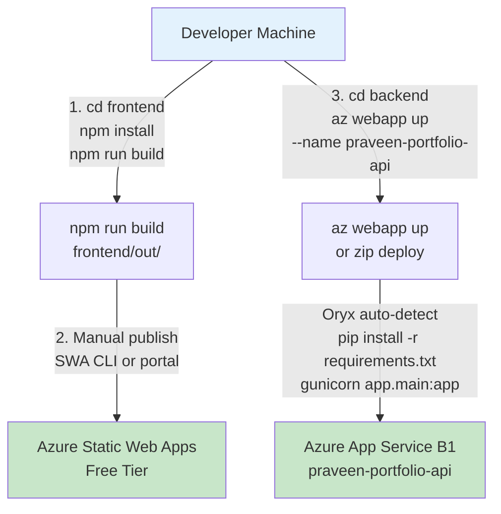

# Architecture

## System Overview

The portfolio is a statically-generated Next.js frontend served from Azure Static Web Apps (Free tier), backed by a Python FastAPI service running on Azure App Service B1 (Central US). No database — all content is hardcoded in Python lists. No CI/CD pipelines — deployments are manual.

```mermaid
flowchart LR
    Browser[Browser]
    SWA[Azure Static Web Apps<br/>Free Tier<br/>Next.js Static Export]
    API[Azure App Service B1<br/>Central US<br/>FastAPI + gunicorn/uvicorn]
    Projects[/api/projects<br/>7 hardcoded items]
    Experience[/api/experience<br/>returns empty list]
    Contact[/api/contact<br/>⚠️ drops messages<br/>print only]
    Data[(In-memory<br/>Python lists)]
    
    Browser -->|HTTPS| SWA
    Browser -->|HTTPS CORS| API
    API --> Projects
    API --> Experience
    API --> Contact
    Projects -.-> Data
    Experience -.-> Data
    Contact -.-> Data
    
    style Contact fill:#fee
    style Data fill:#f9f9f9
```

**Resource Group:** `PersonalWebsite`  
**Subscription:** (Azure subscription with ~$150/mo credit; current burn ~$13/mo)  
**Live URLs:**
- Frontend: https://victorious-mud-064ce4410.7.azurestaticapps.net
- Backend: https://praveen-portfolio-api.azurewebsites.net

---

## Component Details

### Frontend Stack

**Framework:** Next.js 16.2.3 (App Router, TypeScript, React 19.2.4)  
**Styling:** Tailwind CSS v4 (PostCSS plugin)  
**Build:** Static export (`output: "export"` in [`frontend/next.config.ts`](../frontend/next.config.ts))  
**Output:** HTML/CSS/JS files in `frontend/out/`

**Pages:**
- `/` — Home ([`frontend/app/page.tsx`](../frontend/app/page.tsx))
- `/about` — About (static)
- `/experience` — Experience timeline (static; no API integration yet)
- `/projects` — Project gallery (client-side, fetches `/api/projects`)
- `/contact` — Contact form (client-side, POSTs to `/api/contact`)

**Shared Components:**
- [`components/Navbar.tsx`](../frontend/components/Navbar.tsx)
- [`components/Footer.tsx`](../frontend/components/Footer.tsx)
- Layout: [`app/layout.tsx`](../frontend/app/layout.tsx) (Geist font, gray-50 background)

**Environment Variables:**
- `NEXT_PUBLIC_API_URL` — set in `.env.production` (Azure API URL) and `.env.local` (localhost:8000)

---

### Backend Stack

**Framework:** FastAPI 0.135.3  
**Runtime:** Python 3.11, uvicorn 0.44.0 + gunicorn 23.0.0  
**Server:** Azure App Service B1 (Oryx auto-detect; no committed `Procfile`)  
**Entry:** [`backend/app/main.py`](../backend/app/main.py) (mounts three routers under `/api/*`)

**API Routes:**
- **GET `/api/projects`** — [`backend/app/routes/projects.py`](../backend/app/routes/projects.py) — returns 7 hardcoded projects (Python list)
- **GET `/api/experience`** — [`backend/app/routes/experience.py`](../backend/app/routes/experience.py) — returns `[]` (not implemented)
- **POST `/api/contact`** — [`backend/app/routes/contact.py`](../backend/app/routes/contact.py) — prints message to stdout, returns `{"status": "success"}` — **does not persist or send email**

**CORS:** Hardcoded allowlist in [`backend/app/main.py`](../backend/app/main.py):
```python
allow_origins=[
    "http://localhost:3000",
    "https://victorious-mud-064ce4410.7.azurestaticapps.net",
]
```

**Dependencies:** [`backend/requirements.txt`](../backend/requirements.txt)

---

### Azure Resources

| Resource                     | SKU/Tier         | Location    | Monthly Cost (approx) |
|------------------------------|------------------|-------------|------------------------|
| App Service Plan (`portfolio-plan`) | B1         | Central US  | ~$13                   |
| App Service (`praveen-portfolio-api`) | (uses plan above) | Central US | included               |
| Static Web Apps              | Free             | global edge | $0                     |
| **Total**                    |                  |             | **~$13/mo**            |

**Resource Group:** `PersonalWebsite` (configured in [`backend/.azure/config`](../backend/.azure/config))

---

### Request Flow

**Example: Browser loads `/projects` page**

1. Browser requests `https://victorious-mud-064ce4410.7.azurestaticapps.net/projects`
2. Azure SWA CDN serves static HTML/JS from `frontend/out/projects/index.html`
3. Client-side React hydrates; `projects/page.tsx` runs `useEffect` → `fetch(process.env.NEXT_PUBLIC_API_URL + "/api/projects")`
4. Browser sends `GET https://praveen-portfolio-api.azurewebsites.net/api/projects` with CORS preflight
5. App Service B1 runs gunicorn → uvicorn → FastAPI → `projects.router`
6. [`backend/app/routes/projects.py`](../backend/app/routes/projects.py) returns hardcoded Python list (7 projects)
7. JSON response sent back to browser; React renders project cards

**No database query.** All data lives in Python source files.

---

## Known Gaps

- **No CI/CD pipelines** — README references GitHub Actions workflows (`frontend.yml`, `backend.yml`) and Dockerfiles, but none exist in `.github/workflows/` (only squad tooling). Deployments are manual: `az webapp up` for backend, SWA CLI or portal publish for frontend.
- **Contact form broken** — `/api/contact` endpoint prints to stdout but does not persist messages or send email. Users receive success confirmation but message is lost.
- **Experience endpoint empty** — `/api/experience` returns `[]`; frontend `experience` page is static and does not fetch data.
- **README aspirational** — README claims Azure SQL + Blob + Docker; actual stack has no DB, no Blob, no Dockerfiles.
- **CORS hardcoded** — SWA hostname is hardcoded in `main.py`; changing frontend URL requires backend code change.
- **No observability** — No Application Insights, structured logging, or health checks (beyond root `/` endpoint).
- **No secrets management** — No email service configured; no `.env` or Key Vault usage for backend secrets.

---

## Deployment Flow (AS-IS)

Current deployment is **manual**. Automation is tracked as a gap (Priority 1 in [`.squad/decisions.md`](../.squad/decisions.md)).



**Frontend deployment:**
1. Developer runs `npm install && npm run build` in `frontend/`
2. Next.js outputs static files to `frontend/out/`
3. Developer manually publishes via SWA CLI (`swa deploy`) or Azure portal
4. CDN propagates changes globally (~2-5 minutes)

**Backend deployment:**
1. Developer runs `az webapp up --name praveen-portfolio-api --resource-group PersonalWebsite` from `backend/`
2. Azure CLI zips source, uploads to App Service
3. Oryx build system detects Python, runs `pip install -r requirements.txt`
4. App Service starts gunicorn with uvicorn workers (implicit command; no `Procfile`)
5. Backend live after container restart (~30-60 seconds)

**Future (TBD):**
- GitHub Actions workflow triggers on push to `main`
- Separate jobs for frontend (SWA deploy) and backend (App Service zip deploy)
- Optional: Docker build for backend (requires Dockerfile creation)

---

## Change Log

| Date       | Change                                       |
|------------|----------------------------------------------|
| 2026-04-16 | Initial architecture documentation (Morpheus) |
